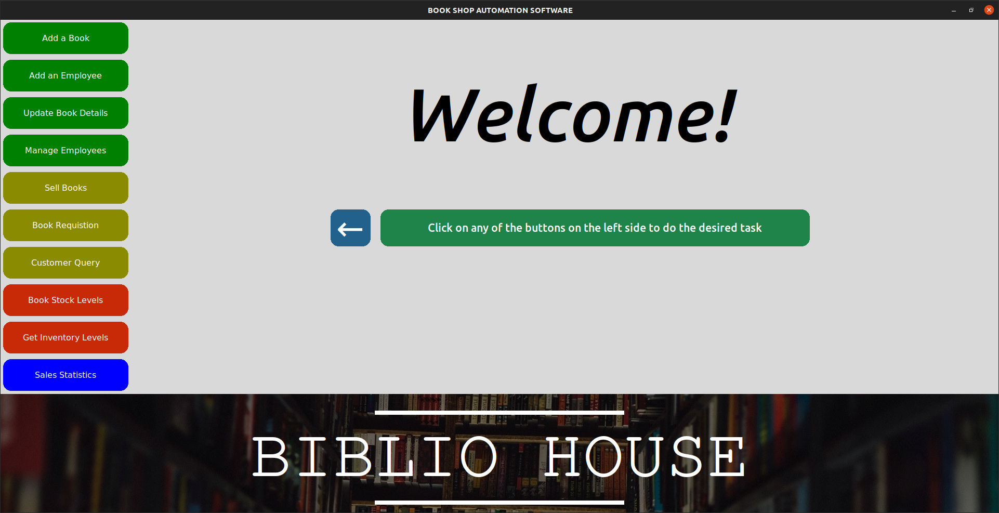
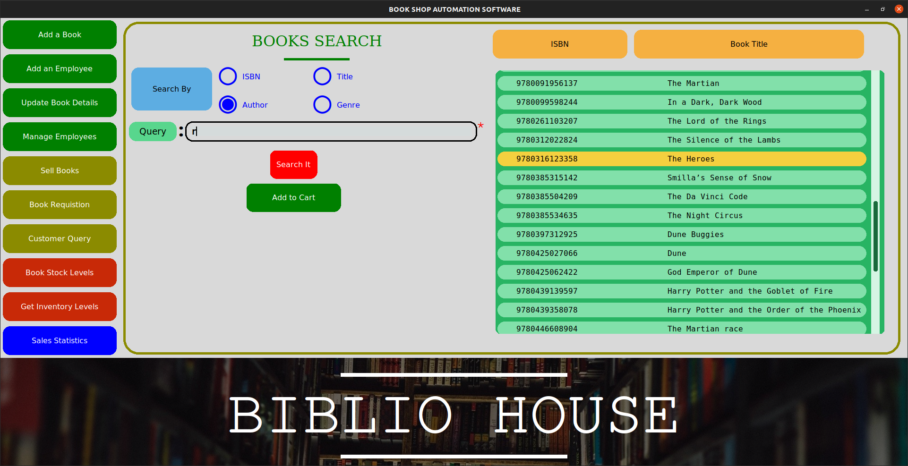

# BAS
## Book-Shop Automation Software

*We need to develop a software for automating various activities of a small book shop. From a
discussion with the owner of the book shop, the following user requirements have been arrived
at:*

BAS should help the customers query whether a book is in stock. The users can query theavailability of a book either by using the book title or by using the name of the author. If the book is not currently being sold by the book-shop, then the customer is asked to enter full details of the book for procurement of the book in future. If a book is in stock, the exact number of copiesavailable and the rack number in which the book is located should be displayed. If a book is notin stock, the query for the book is used to increment a request field for the book. The managercan periodically view the request field of the books to arrive at a rough estimate regarding thecurrent demand for different books.  BAS should maintain the price of various books. As soon as a customer selects a book for purchase, the sales clerk would enter the ISBN number of the book. BAS should update the stock, and generate the sales receipt for the book.   BAS shouldallow employees to update the inventory whenever new supply arrives. Also upon request, BASshould generate sales statistics (viz., book name, publisher, ISBN number, number of copiessold, and the sales revenue) for any period. The sales statistics will help the owner to know theexact business done over any period of time and also to determine inventory level required forvarious books. The inventory level required for a book is equal to the number of copies of thebook sold over a period of two weeks multiplied by the average number of days it takes toprocure the book.  For every book, depending on the publisher of the book, the shop needs tomaintain the details of a stockist (vendor) of the book. Every day the book shop owner wouldgive a command for the BAS to print the books which have fallen below the threshold and thenumber of copies to be procured along with the full address of the stockist.

## The login manager

## The BAS greeter welcoming the user

## A moment from searching a book

