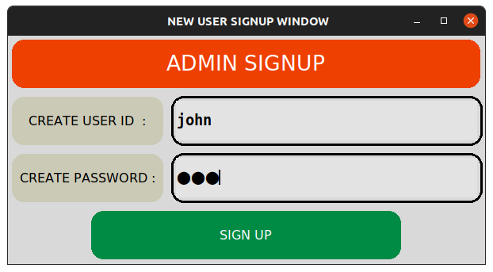

# BAS
## Book-Shop Automation Software

*We need to develop a software for automating various activities of a small book shop. From a
discussion with the owner of the book shop, the following user requirements have been arrived
at:*

BAS should help the customers query whether a book is in stock. The users can query the
availability of a book either by using the book title or by using the name of the author. If the book
is not currently being sold by the book-shop, then the customer is asked to enter full details of
the book for procurement of the book in future. If a book is in stock, the exact number of copies
available and the rack number in which the book is located should be displayed. If a book is not
in stock, the query for the book is used to increment a request field for the book. The manager
can periodically view the request field of the books to arrive at a rough estimate regarding the
current demand for different books. BAS should maintain the price of various books. As soon as
a customer selects a book for purchase, the sales clerk would enter the ISBN number of the
book. BAS should update the stock, and generate the sales receipt for the book. BAS should
allow employees to update the inventory whenever new supply arrives. Also upon request, BAS
should generate sales statistics (viz., book name, publisher, ISBN number, number of copies
sold, and the sales revenue) for any period. The sales statistics will help the owner to know the
exact business done over any period of time and also to determine inventory level required for
various books. The inventory level required for a book is equal to the number of copies of the
book sold over a period of two weeks multiplied by the average number of days it takes to
procure the book. For every book, depending on the publisher of the book, the shop needs to
maintain the details of a stockist (vendor) of the book. Every day the book shop owner would
give a command for the BAS to print the books which have fallen below the threshold and the
number of copies to be procured along with the full address of the stockist.

## The login manager

